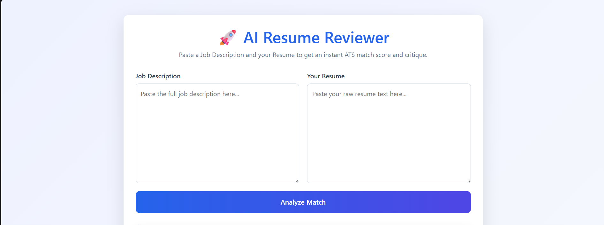
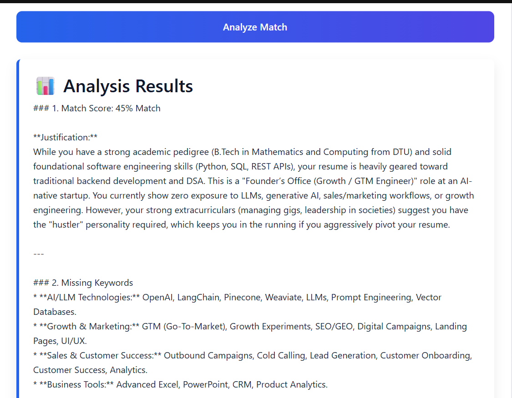

# 🚀 AI Resume Reviewer

An AI-powered web application that analyzes a candidate's resume against a job description using Google's Gemini API and provides an ATS-style evaluation with actionable feedback.

---

## ✨ Features

- 📄 Resume vs Job Description analysis
- 🤖 AI-powered ATS match scoring
- 🔍 Missing keyword detection
- 💡 Personalized resume improvement suggestions
- ⚡ Fast response using Google Gemini API
- 🌐 Clean and responsive web interface

---

## 🛠 Tech Stack

- Python
- Flask
- Google Gemini API (`google-genai`)
- HTML
- CSS
- Bootstrap 5
- JavaScript

---

## 📂 Project Structure

```
AI_Resume_Reviewer/
│
├── app.py
├── .env
├── requirements.txt
├── README.md
│
├── templates/
│   └── index.html
│
└── static/
```

---

## ⚙️ Installation

Clone the repository

```bash
git clone <repository-url>
cd AI_Resume_Reviewer
```

Create a virtual environment

```bash
python -m venv .venv
```

Activate it

Windows

```bash
.venv\Scripts\activate
```

Linux/macOS

```bash
source .venv/bin/activate
```

Install dependencies

```bash
pip install -r requirements.txt
```

---

## 🔑 Environment Variables

Create a `.env` file.

```
GEMINI_API_KEY=YOUR_API_KEY
```

Get your API key from Google AI Studio.

---

## ▶️ Running the Project

```bash
python app.py
```

Open your browser:

```
http://127.0.0.1:5000
```

---

## 📸 Screenshots

### Home Page



### Analysis Results



## 📈 Future Improvements

- Resume PDF upload
- Download report as PDF
- ATS score visualization
- Keyword highlighting
- Authentication system
- Resume history

---

## 👨‍💻 Author

**Mohd Kalam**

B.Tech Mathematics & Computing

Delhi Technological University (DTU)
